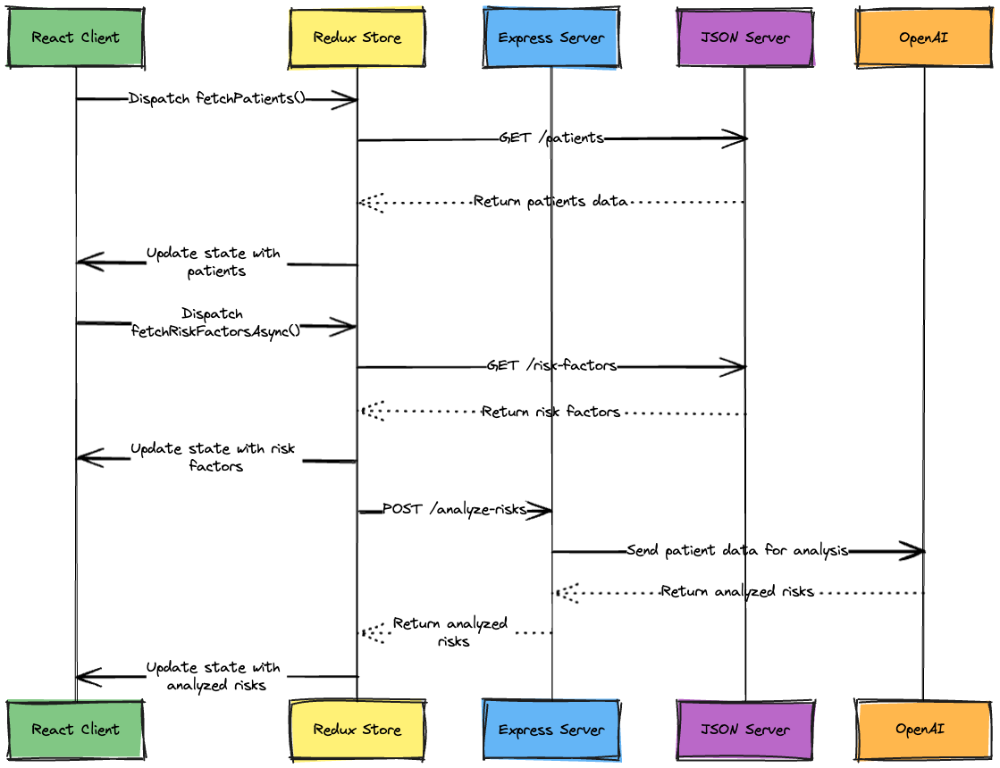

# Take home assignment

## Goal

Create a react app and build one screen as specified in a figma file which will be shared separately via email.

## Users

This app will be used by dermatologists when they review a patient's case.

## Requirements

- This app should make use of [Material UI](https://mui.com/material-ui/getting-started/) for design and components.
- Your code should be written in Javascript.
- Use Redux for state management.

## Submission

- Fork this github repository and check in your code.
- Create a new branch with your name and start working on the assignment.
- Once you are done, push your changes to your forked repository and share the link with us.
- Please include a screen recording of the functionality in your README file.

## Getting Started

- Fork this repository and clone it to your local machine.
- Run `npm install` to install all the dependencies.
- Run `npm run server` to start the json (db) server.
  - This will start the json server on port 3001.
  - The endpoint to fetch the data is `http://localhost:3001/patients`.
    - Try `curl http://localhost:3001/patients` to see the data and get familiar with the structure.
- LLM features
  - Run `npm run express-server` to start the backend server with the LLM API calls.
    This will start the server on port 3002.
  - Create a `.env` file in the root directory and add your OpenAI API key (OPENAI_API_KEY):
- Run `npm start` to start the app.
  - Runs the app in the development mode.
  - Open [http://localhost:3000](http://localhost:3000) to view it in your browser.
  - The page will reload when you make changes.
  - You may also see any lint errors in the console.
- I have created a simple component and the first page in the `src/components` and `src/pages` respectively to save time on boilerplate code setup. You can use them as needed.

## Loom Recording

🎬 [Loom Recording Link](https://www.loom.com/share/082bb91cbbf54c00b85533c26110cdc2?sid=2d6190cf-ae07-4bb8-b881-564134ae7845)

## Network Flow

### Sequence Diagram

### Explanation

This sequence diagram illustrates the network flow and interactions between different components of the application:

1. **Fetching Patients Data**:

   - The React Client dispatches the `fetchPatients()` action to the Redux Store.
   - The Redux Store sends a GET request to the JSON Server to fetch patients data.
   - The JSON Server returns the patients data to the Redux Store.
   - The Redux Store updates the React Client with the fetched patients data.

2. **Fetching Risk Factors**:

   - The React Client dispatches the `fetchRiskFactorsAsync()` action to the Redux Store.
   - The Redux Store sends a GET request to the JSON Server to fetch risk factors.
   - The JSON Server returns the risk factors to the Redux Store.
   - The Redux Store updates the React Client with the fetched risk factors.

3. **Analyzing Patient Risks**:
   - The Redux Store sends a POST request to the Express Server to analyze risks for each patient.
   - The Express Server forwards the patient data to the OpenAI API for analysis.
   - OpenAI returns the analyzed risks to the Express Server.
   - The Express Server sends the analyzed risks back to the Redux Store.
   - The Redux Store updates the React Client with the analyzed risks for each patient.

This flow ensures that the application fetches all necessary data and performs risk analysis for patients, providing a useful view for dermatologists reviewing patient cases.
